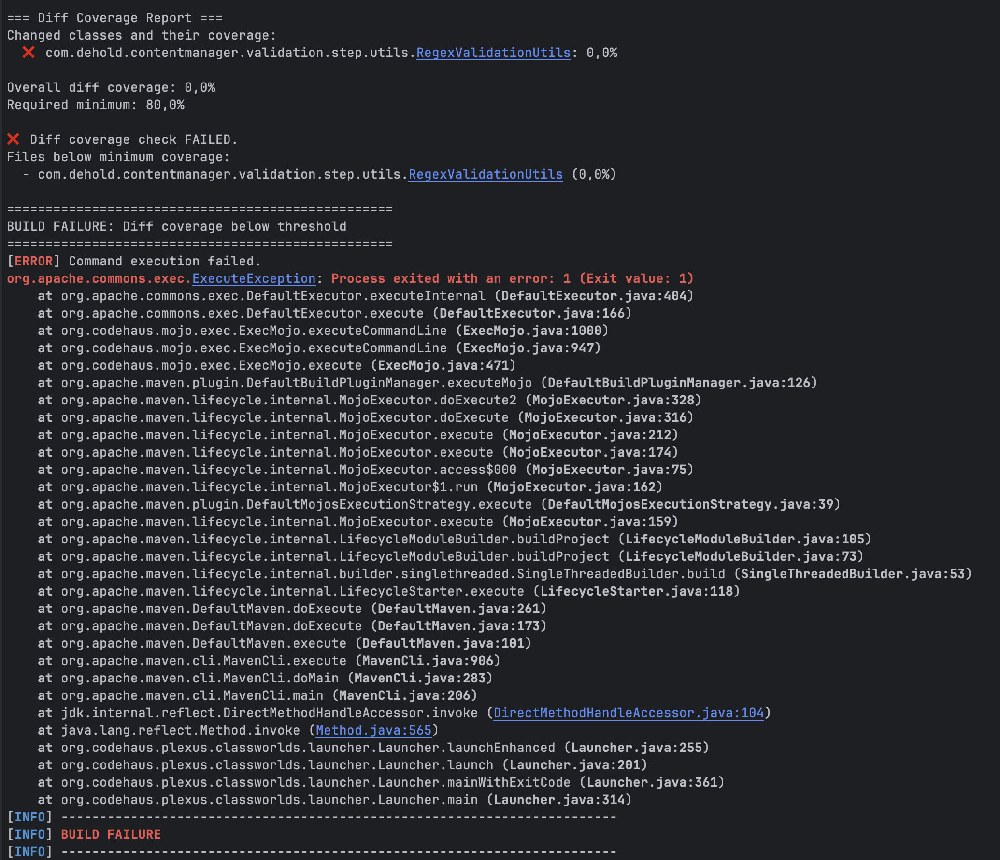

# Content Manager Service

A Spring Boot service that helps create, manage, validate and moderate content. This service provides RESTful APIs for managing various types of content including users, blog posts, customer support requests, and support responses.

## How to Contribute

1. Check the list of features below to avoid duplicates
1. Mention the feature in the Slack channel
1. Create the issue:
   1. Create a new issue with the feature details from the feature list.
   1. **Use the following structure**: `Summary`, `Current Behavior`, `Expected Behavior`, `Additional Context` (see an 
      example [here](https://github.com/Turing-dev-community/content-manager/issues/42))
1. Implement the feature:
   1. Create a new branch for your feature named `feature/your-feature-name` or `fix/your-bug-fix`
   1. Implement the feature or bug fix
   1. **Update the feature list**
   1. Merge the latest `main` into your branch and run `mvn clean install` (for code coverage build failures check 
      the [Test Coverage](#test-coverage) section)
   1. Create a pull request to merge your changes back to main
   1. Inform repository owner for review

## Features

### List of Features

Please update for each new feature:

| date (YY-MM-DD) | contributor email       | feature summary                                                                                                                                 | feature description                                                                                                                                                                                                                                                                                                                                                                                                                                           | issue link                                                                 |
|-----------------|-------------------------|-------------------------------------------------------------------------------------------------------------------------------------------------|---------------------------------------------------------------------------------------------------------------------------------------------------------------------------------------------------------------------------------------------------------------------------------------------------------------------------------------------------------------------------------------------------------------------------------------------------------------|----------------------------------------------------------------------------|
| 2025-11-12      | denis.h@turing.com      | Add ednpoint to run validations against all blog posts                                                                                          | Endpoint `api/users/:id/validate-blogposts` that runs validations against all blog posts owned by the user and persists them.                                                                                                                                                                                                                                                                                                                                 | [#52](https://github.com/Turing-dev-community/content-manager/issues/52)   |
| 2025-11-13      | denis.h@turing.com      | Validation Reports                                                                                                                              | Added new endpoint `/api/users/:id/validation-report` that provides a summary report of validation results for all content owned by a user.                                                                                                                                                                                                                                                                                                                   | [#53](https://github.com/Turing-dev-community/content-manager/issues/57)   |
| 2025-11-14      | denis.h@turing.com      | Introduce a Generic Content Model                                                                                                               | More flexible content creation by providing a generic content model that allows custom content types and fields                                                                                                                                                                                                                                                                                                                                               | [#61](https://github.com/Turing-dev-community/content-manager/issues/61)   |
| 2025-11-14      | riddhi.s@turing.com     | Add pagination to GET /api/blogposts                                                                                                            | Add `page` and `size` query params to blog post list endpoint. Return paginated response with metadata.                                                                                                                                                                                                                                                                                                                                                       | [#55](https://github.com/Turing-dev-community/content-manager/issues/55)   |
| 2025-11-17      | riddhi.s@turing.com     | Add ProductOffer content type                                                                                                                   | New marketplace-ready content type with pricing, stock, delivery fields. Model + repository + schema. No API yet.                                                                                                                                                                                                                                                                                                                                             | [#74](https://github.com/Turing-dev-community/content-manager/issues/74)   |
| 2025-11-15      | riddhi.s@turing.com     | Allow users to validate customer support responses                                                                                              | Endpoint `/api/users/{id}/validate-supportresponses` that runs validations against all `SupportResponse` entries owned by the user and persists results. Fixes circular `NOT NULL` dependency in DB schema.                                                                                                                                                                                                                                                   | [#67](https://github.com/Turing-dev-community/content-manager/issues/67)   |
| 2025-11-17      | pushpendra.s@turing.com | Add Comments to Blog Posts                                                                                                                      | Enhance the BlogPost functionality to support a list of comments. Each blog post may contain multiple comments, and each comment should include.                                                                                                                                                                                                                                                                                                              | [#75](https://github.com/Turing-dev-community/content-manager/issues/75)   |
| 2025-11-17      | pushpendra.s@turing.com | Regex Validator                                                                                                                                 | Implement a new validation step called RegexValidator that validates arbitrary content fields against a provided regular expression.                                                                                                                                                                                                                                                                                                                          | [#72](https://github.com/Turing-dev-community/content-manager/issues/72)   |
| 2025-11-17      | pushpendra.s@turing.com | Downloadable User Content Export                                                                                                                | Implement a new API endpoint that allows users to download all their stored blog posts as a single JSON file. The endpoint must return the JSON file as an attachment using the Content-Disposition header. This allows users to back up or migrate their data.                                                                                                                                                                                               | [#58](https://github.com/Turing-dev-community/content-manager/issues/58)   |
| 2025-11-17      | ankita.k@turing.com     | Blog Post Version History                                                                                                                       | Add support for tracking and retrieving the historical versions of a blog post.                                                                                                                                                                                                                                                                                                                                                                               | [#48](https://github.com/Turing-dev-community/content-manager/issues/48)   |
| 2025-11-17      | ankita.k@turing.com     | Prepare for Basic Authentication                                                                                                                | The application will support basic authentication in the future.                                                                                                                                                                                                                                                                                                                                                                                              | [#54](https://github.com/Turing-dev-community/content-manager/issues/54)   |
| 2025-11-18      | ankita.k@turing.com     | Allow users to validate customer support requests                                                                                               | Add a new endpoint "/api/users/validate-supportrequests" that allows to run validations of the SupportRequest content against previously configured ValidationPipelines.                                                                                                                                                                                                                                                                                      | [#56](https://github.com/Turing-dev-community/content-manager/issues/56)   |
| 2025-11-17      | pushpendra.s@turing.com | Downloadable User Content Export                                                                                                                | Implement a new API endpoint that allows users to download all their stored blog posts as a single JSON file. The endpoint must return the JSON file as an attachment using the Content-Disposition header. This allows users to back up or migrate their data.                                                                                                                                                                                               | [#58](https://github.com/Turing-dev-community/content-manager/issues/58)   |
| 2025-11-18      | riddhi.s@turing.com     | Add global full-text search for blog posts                                                                                                      | Global case-sensitive substring search across all blog posts using SQL LIKE on title and content. Endpoint: `GET /api/blog-posts/{id}/search?term=...`. Returns list of matching blog post IDs.                                                                                                                                                                                                                                                               | [#85](https://github.com/Turing-dev-community/content-manager/issues/85)   |
| 2025-11-18      | pushpendra.s@turing.com | CSV Content Export                                                                                                                              | Implement CSV export support for all user-owned BlogPosts. Extend the existing export endpoint to accept a format query parameter that determines whether the response should be JSON (default) or CSV.                                                                                                                                                                                                                                                       | [#90](https://github.com/Turing-dev-community/content-manager/issues/90)   |
| 2025-11-18      | ankita.k@turing.com     | Add rate limiting to the APIs                                                                                                                   | Add in-memory rate limiting to all api endpoints                                                                                                                                                                                                                                                                                                                                                                                                              | [#60](https://github.com/Turing-dev-community/content-manager/issues/60)   |
| 2025-11-18      | riddhi.s@turing.com     | Add CRUD API for ProductOffer content type                                                                                                      | Full REST API for ProductOffer with create, read (by ID/all/user), update, and delete endpoints under `/api/product-offers`. Includes controller, service, DTOs, and 10 tests (6 integration + 4 unit).                                                                                                                                                                                                                                                       | [#92](https://github.com/Turing-dev-community/content-manager/issues/92)   |
| 2025-11-18      | pushpendra.s@turing.com | Extend the existing content export functionality so that a user's Support Requests and Support Responses are also included in the export result | [#122](https://github.com/Turing-dev-community/content-manager/issues/122)                                                                                                                                                                                                                                                                                                                                                                                    |
| 2025-11-19      | pushpendra.s@turing.com | Export XML formate                                                                                                                              | Extend the existing content export functionality to support XML formate                                                                                                                                                                                                                                                                                                                                                                                       | [#101](https://github.com/Turing-dev-community/content-manager/issues/101) |
| 2025-11-19      | riddhi.s@turing.com     | User webhook support                                                                                                                            | Users can register, list, update and delete their own webhook URLs to receive real-time notifications. Full CRUD via `/api/users/{userId}/webhooks`, strict URL validation, ownership enforced, returns 400 on invalid URL and 404 on missing user/webhook.                                                                                                                                                                                                   | [#95](https://github.com/Turing-dev-community/content-manager/issues/95)   |
| 2025-11-20      | riddhi.s@turing.com     | Add Retry Logic for SupportRequest Fetching                                                                                                     | Implemented retry mechanism (`@Retryable`) for transient database failures in `SupportRequestService` methods (`findAll`, `findById`), with a fallback (`@Recover`) to return `503 Service Unavailable` on max retries.                                                                                                                                                                                                                                       | [#109](https://github.com/Turing-dev-community/content-manager/issues/109) |
| 2025-11-19      | pushpendra.s@turing.com | Export content by contentType                                                                                                                   | Introduce support for exporting only a specific content type for a given user.                                                                                                                                                                                                                                                                                                                                                                                | [#99](https://github.com/Turing-dev-community/content-manager/issues/99)   |
| 2025-11-19      | ankita.k@turing.com     | Implement basic authentication                                                                                                                  | Implement jdbc basic auth. Secure the endpints that allow to update or delete users                                                                                                                                                                                                                                                                                                                                                                           | [#129](https://github.com/Turing-dev-community/content-manager/issues/129) |
| 2025-11-19      | denis.h@turing.com      | Introduce generic content api                                                                                                                   | Users should be able to manage Generic Content (see issue [#61](https://github.com/Turing-dev-community/content-manager/issues/61)) via an API.                                                                                                                                                                                                                                                                                                               | [#105](https://github.com/Turing-dev-community/content-manager/issues/105) |
| 2025-11-20      | riddhi.s@turing.com     | Add Caching to SupportRequest API                                                                                                               | Implemented high-performance in-memory caching using Caffeine for findAll and findById in SupportRequestService.Cache is automatically invalidated (@CacheEvict) on createCustomerRequest, updateCustomerRequest, and deleteById to ensure data consistency and reduce database load.                                                                                                                                                                         | [#112](https://github.com/Turing-dev-community/content-manager/issues/112) |
| 2025-11-20      | denis.h@turing.com      | Integrate Generic Content with the Validation Pipeline                                                                                          | Users should <br/>it should be able to run validation pipelines against Generic Content Models (see issue [#61](https://github.com/Turing-dev-community/content-manager/issues/61)). This would allow for more flexibility, as any user-created content type could be validated.                                                                                                                                                                              | [#106](https://github.com/Turing-dev-community/content-manager/issues/106) |
| 2025-11-20      | pushpendra.s@turing.com | Bulk Export by list of user IDs and Content Type                                                                                                | Adds a POST endpoint to export only the items matching a provided UUID list, supporting JSON, CSV, and XML. This extends existing export options by enabling fine-grained, ID-based export across multiple content types.                                                                                                                                                                                                                                     | [#100](https://github.com/Turing-dev-community/content-manager/issues/100) |
| 2025-11-20      | riddhi.s@turing.com     | Integrate RegexValidator into Validation Pipeline                                                                                               | Enabled `REGEX_VALIDATION` step in user-defined validation pipelines via `POST /api/validation-pipelines`. Fully integrated with `/api/users/{id}/validate-blogposts` — runs case-insensitive, returns `REGEX_VALIDATION_FAILED` with field name and pattern in message.                                                                                                                                                                                      | [#102](https://github.com/Turing-dev-community/content-manager/issues/102) |
| 2025-11-20      | ankita.k@turing.com     | Implement Ratelimit per API                                                                                                                     | Make rate limits configurable per API                                                                                                                                                                                                                                                                                                                                                                                                                         | [#97](https://github.com/Turing-dev-community/content-manager/issues/97)   |
| 2025-11-20      | pushpendra.s@turing.com  | Add detail validation reporting                                                                                                                | Validation result reporting was introduced with #57 . This structure provides an overall count on validation errors and a coutn for validation errors per error type. However, users might be interested in more details such as: Errors per content type Errors per content type and error type                                                                                                                                                              | [#103](https://github.com/Turing-dev-community/content-manager/issues/103)                                                                                                                                                                                                            |
| 2025-12-02      | siddhartha.s@turing.com          | Add FaqPage content type                                                                                                                        | New `FaqPage` content type (title, introduction, list of `FaqItem` objects) with repository persistence and integration tests. No controller API required for initial persistence verification.                                                                                                                                                | [#93](https://github.com/Turing-dev-community/content-manager/issues/93)                         |
| 2025-11-21      | ankita.k@turing.com     | Implement Soft delete for blog posts                                                                                                            | soft-delete functionality for blog posts and enhances all GET endpoints to optionally return soft-deleted data.                                                                                                                                                                                                                                                                                                                                               | [#120](https://github.com/Turing-dev-community/content-manager/issues/120) |
| 2025-11-21      | denis.h@turing.com      | Add a Numeric Range Validator                                                                                                                   | A validator that checks numeric value ranges.                                                                                                                                                                                                                                                                                                                                                                                                                 | [#148](https://github.com/Turing-dev-community/content-manager/issues/148) |
| 2025-11-21      | riddhi.s@turing.com | Add caching to BlogPost & SupportResponse APIs | Implemented high-performance caching using Spring Cache + Caffeine across all read-heavy endpoints for `BlogPost` and `SupportResponse`. Follows the proven pattern from #112. Includes proper `@Cacheable` on all list/single/paginated/search reads and `@CacheEvict(allEntries=true)` on create/update/delete/restore. Export and history endpoints intentionally excluded (documented).                                                                   | [#113](https://github.com/Turing-dev-community/content-manager/issues/113) |
| 2025-11-21      | riddhi.s@turing.com | Add high-performance caching to GenericContent & ProductOffer APIs | Implemented caching using Spring Cache + Caffeine across **GenericContentService** and **ProductOfferService**, following the proven pattern from #112. Includes `@Cacheable` on all read operations (`getById`, `findByUserIdAndContentType`, `getAll`, `getByUserId`) and `@CacheEvict(allEntries=true)` on all mutations (create, update, delete). Full test coverage with real Caffeine cache, `assertSame()` identity checks, and eviction verification. | [#157](https://github.com/Turing-dev-community/content-manager/issues/157) |
| 2025-11-21      | ankita.k@turing.com     | Duplicate Validation Results | Remove duplicate validation results, update duplicate entries, not insert                                                                                                                                                                                                                                                                                                                                                                                     | [#111](https://github.com/Turing-dev-community/content-manager/issues/111) |
| 2025-11-21      | denis.h@turing.com      | Improvements for Numeric Range Validation                                                                                                                  | The NumberRangeValidator should be enhanced to allow specifying whether the boundaries are inclusive or exclusive.                                                                                                                                                                                                             | [#153](https://github.com/Turing-dev-community/content-manager/issues/153)|
| 2025-11-21      | pushpendra.s@turing.com      | Export content by list of content ids                                                                                                                  | Add bulk-export support for content items by their own IDs. A POST request will accept a list of UUIDs and export only items matching those IDs and the chosen content type.                                                                                                                                                                                                             | [#145](https://github.com/Turing-dev-community/content-manager/issues/145) |
| 2025-11-24      | riddhi.s@turing.com | Full caching rollout: Webhook + User services | Completed high-performance caching (Spring Cache + Caffeine) for **WebhookService** and **UserService**. Added `@Cacheable` on `getUser(UUID)`, `getWebhookById(UUID)`, and `getWebhooksByUserId(UUID)` with proper `@CacheEvict` on all mutations (create/update/delete).                                                                                                                                                                                    | [#159](https://github.com/Turing-dev-community/content-manager/issues/159) |
| 2025-11-25      | ankita.k@turing.com     |Validated Version-Restore Mechanism in BlogPostService.                                                                                                | Restoring a historical blog post version should automatically run all validation pipelines configured for the user, persist all validation results, and return them to the client. | [#114](https://github.com/Turing-dev-community/content-manager/issues/114) |
| 2025-11-25      | ankita.k@turing.com     | Export Validation Report Json                                                                                                                   | Export Validation Report in Json   format                                                                                                                                                                                                                                                                                                                                                                                                                     | [#115](https://github.com/Turing-dev-community/content-manager/issues/115) |

| 2025-12-02      | siddhartha.s@turing.com | Add Blog Post Moderation Workflow (DRAFT/PENDING_REVIEW/APPROVED/REJECTED) | Introduce `state` enum on `BlogPost` and add endpoints `POST /api/blogposts/{id}/submit-for-review`, `/approve`, `/reject`. Persist `state` (default `DRAFT`), validate transitions in `BlogPostService` (throw `InvalidStateTransitionException` → mapped to HTTP 400 via `GlobalExceptionHandler`), and add unit + integration tests including 404 handling via `EntityNotFoundException`. | [#94](https://github.com/Turing-dev-community/content-manager/issues/94) |

### Blog Post Moderation Workflow

This project includes a moderation workflow for `BlogPost` entities. The workflow introduces four states and API endpoints to explicitly move posts through review and approval.

- States:
  - `DRAFT` (default on creation)
  - `PENDING_REVIEW`
  - `APPROVED`
  - `REJECTED`

- API Endpoints:
  - `POST /api/blogposts/{id}/submit-for-review`
    - Moves a `DRAFT` post to `PENDING_REVIEW`.
    - Responses:
      - `200 OK`: returns the updated `BlogPost` with `state: PENDING_REVIEW`.
      - `404 Not Found`: when the blog post id does not exist. This uses `EntityNotFoundException` handled by `GlobalExceptionHandler` to produce a `CustomErrorResponse` (see example below).
      - `400 Bad Request`: invalid transition, returns `CustomErrorResponse` with a clear message (e.g. "Only DRAFT posts can be submitted for review.").

  - `POST /api/blogposts/{id}/approve`
    - Moves a `PENDING_REVIEW` post to `APPROVED`.
    - Responses: `200 OK`, `404 Not Found`, `400 Bad Request` (e.g. "Only PENDING_REVIEW posts can be approved.").

  - `POST /api/blogposts/{id}/reject`
    - Moves a `PENDING_REVIEW` post to `REJECTED`.
    - Responses: `200 OK`, `404 Not Found`, `400 Bad Request` (e.g. "Only PENDING_REVIEW posts can be rejected.").

- Implementation notes:
  - Add a `state` enum to the `BlogPost` model and persist it in the `blog_post` table. Existing rows should default to `DRAFT` via schema migration.
  - Enforce transitions in `BlogPostService`. Throw an `InvalidStateTransitionException` for invalid transitions and map it to HTTP 400 in `GlobalExceptionHandler` so responses use `CustomErrorResponse`.
  - Add unit tests for service-level transition logic and integration tests for controller endpoints to verify HTTP behavior and error payloads.

- Example success payload (`200 OK`):

```json
{
  "id": "cfe786d4-1303-4cae-978f-df93b4b84a6b",
  "title": "My Post",
  "content": "…",
  "userId": "123e4567-e89b-12d3-a456-426614174000",
  "createdAt": "2025-11-20T10:00:00Z",
  "updatedAt": "2025-11-20T10:05:00Z",
  "state": "PENDING_REVIEW"
}
```

- Example 404 `CustomErrorResponse` (tests expect the `message` to follow this pattern):

```json
{
  "timestamp": "2025-11-20T10:00:00Z",
  "status": 404,
  "error": "Not Found",
  "message": "The entity BlogPost with id cfe786d4-1303-4cae-978f-df93b4b84a6b does not exist",
  "path": "/api/blogposts/cfe786d4-1303-4cae-978f-df93b4b84a6b/submit-for-review"
}
```

See `.github/ISSUE_TEMPLATE/blogpost-moderation.md` for a canonical issue body and examples used by tests.

### Overview
- **Content Management**: Create, read, update, and delete various content types
- **Validation Pipeline**: Configurable validation system with support for length checks and custom validators
- **Database Support**: H2 for testing, MySQL for production
- **Profile-based Configuration**: Separate configurations for test and production environments


### Test Coverage

#### Run the Test Coverage Tool

The test coverage tool can be triggered via the Maven build the following ways:
1. `mvn clean install`
2. `mvn clean test`

The coverage of modified files must be 80% or more (the files that diff from origin/main), otherwise the build will 
fail. 

The failure message looks like this:




#### Overview of the Tooling

The test coverage is done via the following two tools:
1. [JaCoCo test coverage lib](https://www.jacoco.org/jacoco/): This is a common tool for spring boot applications. 
   It takes care of checking the unit test coverage and provides reports.
2. [DiffTestCoverageChecker](src/main/java/com/dehold/contentmanager/DiffTestCoverageChecker.java): 
   3. A custom tool that validates test coverage on changed files only (diff coverage). It reads the JaCoCo CSV report and ensures that modified files meet the minimum coverage threshold of 80%. The build will fail if any changed file has insufficient test coverage.
   4. Motivation: There is an existing code base with varying test coverage. By checking the coverage against the 
      diff to origin/main, developers are encouraged to improve the test coverage of the files they modify in their 
      PRs. This is an enforcement of the Boy Scout Rule ("Always leave the codebase cleaner than you found it").


### How to Check Feature Details and Implementations

You can find the details for the currently available features by checking the web and service layer of the app:
Each domain(-entity) has its own package (e.g. [content](https://github.com/Turing-dev-community/content-manager/tree/main/src/main/java/com/dehold/contentmanager/content) that contains various content types, or [validation](https://github.com/Turing-dev-community/content-manager/tree/main/src/main/java/com/dehold/contentmanager/validation)
that is responsible for content validation). Each of these packages has different layers:

- `model`: db entities
- `repository`: db operations
- `service`: domain logic
- `web`: controllers etc

By checking the `web` and `service` layers, you can get a good idea of the details of each api.

**Some high level design decisions:**
- The layering should be the same across domains (mode, repository, service, web)
- jdbcTemplate with SQL is used to have control over the queries
- DTOs are used to map requests to the domain models

## Technology Stack

- **Framework**: Spring Boot 3.5.6
- **Database**: H2 (test), MySQL (production)
- **Java Version**: 24
- **Build Tool**: Maven
- **Testing**: JUnit 5, Spring Boot Test

## Getting Started

### Prerequisites

- Java 24 or higher
- Maven 3.6+
- MySQL (for production)

### Running the Application

#### Development Mode (H2 Database)
```bash
./mvnw spring-boot:run
```

#### Production Mode (MySQL Database)
```bash
./mvnw spring-boot:run --spring.profiles.active=prod
```

#### Running Tests
```bash
./mvnw test
```

## API Endpoints

### User Management

| Method | Endpoint | Description                                  |
|--------|----------|----------------------------------------------|
| GET | `/api/users/{id}` | Get user by ID                               |
| POST | `/api/users` | Create new user                              |
| PUT | `/api/users/{id}` | Update existing user                         |
| DELETE | `/api/users/{id}` | Delete user                                  |
| GET | `/api/users/{id}/blogposts` | Retrieve blog posts owned by a specific user |
| GET | `/{id}/validate-restored-blogpost` | Validate Blog posts                          |

**User Model:**
```json
{
  "id": "uuid",
  "alias": "string",
  "email": "string",
  "createdAt": "timestamp",
  "updatedAt": "timestamp",
  "username": "string",
  "password": "string",
  "enabled": "boolean"
}
```

### FAQ Pages

| Method | Endpoint | Description |
|--------|----------|-------------|
| POST | `/api/faqpages` | Create new FAQ page |
| GET | `/api/faqpages/{id}` | Get FAQ page by ID |
| GET | `/api/faqpages/users/{userId}` | Retrieve FAQ pages owned by a specific user |

**FAQ Page Model:**
```json
{
  "id": "uuid",
  "userId": "uuid",
  "title": "string",
  "introduction": "string",
  "faqItems": [
    {
      "title": "string",
      "text": "string"
    }
  ],
  "createdAt": "timestamp",
  "updatedAt": "timestamp"
}
```

### FaqPage Feature Details

- **Summary**: Adds a simple FAQ content type (`FaqPage`) that stores a `title`, `introduction`, and a list of `FaqItem` objects (each with `title` and `text`). The feature provides a repository implementation for persisting FAQ pages in the project's H2/MySQL schema and integration tests that validate persistence and JSON (faq_items) serialization.

- **Acceptance criteria**:
  - `FaqPage` and `FaqItem` model classes exist with sensible fields.
  - `FaqPageRepository` persists and retrieves `FaqPage` objects (FAQ items stored as JSON text in `faq_items` column).
  - DB schema contains a `faq_page` table with `faq_items` column.
  - Integration tests verify storing and reading `FaqPage` from the H2 in-memory database.

- **DB / Migration notes**:
  - `faq_items` is stored as JSON text in `faq_page.faq_items` (TEXT column). If your project uses migrations (Flyway/Liquibase), convert the DDL in `src/main/resources/schema.sql` into a migration script.

- **How to run integration tests**:
  1. Run the repository integration tests only:
     ```powershell
     .\mvnw test -Dtest=FaqPageRepositoryIntegrationTest
     ```
  2. Or run all tests:
     ```powershell
     .\mvnw test
     ```

These tests validate persistence, JSON (faq_items) round-trip, and expected cascade behavior when a user is deleted.

### Blog Posts

| Method | Endpoint | Description                                          |
|--------|----------|------------------------------------------------------|
| GET    | `/api/blog-posts/{id}` | Get blog post by ID                                  |
| POST   | `/api/blog-posts` | Create new blog post                                 |
| PUT    | `/api/blog-posts/{id}` | Update existing blog post                            |
| DELETE | `/api/blog-posts/{id}` | Delete blog post                                     |
| GET    | `/api/blogposts?userId={userId}` | Filter blog posts by user (optional query parameter) |
| GET    | `/{id}/history` | get Blog Post History                                |
| POST   | `/{id}/restore/{version}` | Restore Blog Post Version                            |
| POST   | `/{id}/soft-delete` | Soft Delete|

> **Note:** The endpoint `/api/blogposts/user/{userId}` is now deprecated. Use `/api/blogposts?userId={userId}` instead.

**Blog Post Model:**
```json
{
  "id": "uuid",
  "title": "string",
  "content": "string",
  "createdAt": "timestamp",
  "updatedAt": "timestamp",
  "userId": "uuid",
  "softDeleted":"boolean",
  "deletedAt": "timestamp"
}
```

**BlogPostHistory Model:**

```json
{
  "id": "c1a8e0c2-4c8d-4cf3-b2e4-9eb1d9c7a1ab",
  "blogPostId": "8f0d2c8c-9177-4ae1-a9cf-8e2bd3c417ad",
  "title": "Sample Blog Post Title",
  "content": "This is the content of the blog post version.",
  "versionNumber": 3,
  "createdAt": "2025-02-17T10:15:30Z",
  "updatedAt": "2025-02-17T10:16:10Z"
}
```

### Customer Support Requests

| Method | Endpoint | Description |
|--------|----------|-------------|
| GET | `/api/customer-requests` | Get all customer requests |
| GET | `/api/customer-requests/{id}` | Get customer request by ID |
| POST | `/api/customer-requests` | Create new customer request |
| PUT | `/api/customer-requests/{id}` | Update existing customer request |
| DELETE | `/api/customer-requests/{id}` | Delete customer request |


**Customer Request Model:**
```json
{
  "id": "uuid",
  "text": "string",
  "supportResponse": "uuid",
  "customerId": "uuid",
  "createdAt": "timestamp",
  "updatedAt": "timestamp"
}
```

### Support Responses

| Method | Endpoint | Description |
|--------|----------|-------------|
| GET | `/api/support-responses/{id}` | Get support response by ID |
| POST | `/api/support-responses` | Create new support response |
| PUT | `/api/support-responses/{id}` | Update existing support response |
| DELETE | `/api/support-responses/{id}` | Delete support response |

**Support Response Model:**
```json
{
  "id": "uuid",
  "text": "string",
  "supportRequest": "uuid",
  "createdAt": "timestamp",
  "updatedAt": "timestamp"
}
```

### Validation

| Method | Endpoint | Description                                                                                                                                                                                                                                                            |
|--------|----------|------------------------------------------------------------------------------------------------------------------------------------------------------------------------------------------------------------------------------------------------------------------------|
| POST   | `/api/validate/blogpost` | Validate a blog post                                                                                                                                                                                                                                                   |
| POST   | `/api/validate/validate-blogposts?userId={userId}` | Run validation on all blog posts for a specific user (This has an empty body as it validated blog posts that are stored to the db against validation pipelines that are stored in the db for that specific user). The response is listed under "Bulk Validation Response Example" |
| POST | `/api/users/validate-supportrequests` | Validate Support request |

**Validation Request Model:**
```json
{
  "titleMinLength": "integer",
  "titleMaxLength": "integer",
  "contentMinLength": "integer",
  "contentMaxLength": "integer",
  "blogPost": {
    "id": "uuid",
    "title": "string",
    "content": "string",
    "createdAt": "timestamp",
    "updatedAt": "timestamp",
    "userId": "uuid"
  }
}
```

**Validation Response Model:**
```json
{
  "contentType": "string",
  "validationResult": {
    "contentType": "string",
    "contentId": "uuid",
    "userId": "uuid",
    "valid": "boolean",
    "errors": [
      {
        "code": "string",
        "message": "string"
      }
    ]
  }
}
```

**Bulk Validation Response Example:**
```json
[
  {
    "contentType": "string",
    "validationResult": {
      "contentType": "string",
      "contentId": "uuid",
      "userId": "uuid",
      "valid": true,
      "errors": []
    }
  },
  {
    "contentType": "string",
    "validationResult": {
      "contentType": "string",
      "contentId": "uuid",
      "userId": "uuid",
      "valid": false,
      "errors": [
        {
          "code": "string",
          "message": "string"
        }
      ]
    }
  },
  {
    "contentType": "string",
    "validationResult": {
      "contentType": "string",
      "contentId": "uuid",
      "userId": "uuid",
      "valid": false,
      "errors": [
        {
          "code": "string",
          "message": "string"
        }
      ]
    }
  }
]
```

### Validation Pipelines

| Method | Endpoint | Description |
|--------|----------|-------------|
| GET | `/api/validation-pipelines/{id}` | Get validation pipeline by ID |
| GET | `/api/validation-pipelines?userId={userId}&contentType={contentType}` | Get validation pipelines by user ID and content type |
| POST | `/api/validation-pipelines` | Create new validation pipeline |
| PUT | `/api/validation-pipelines/{id}` | Update existing validation pipeline |
| DELETE | `/api/validation-pipelines/{id}` | Delete validation pipeline |

**Validation Pipeline Model:**
```json
{
  "id": "uuid",
  "userId": "uuid",
  "description": "string",
  "contentType": "string",
  "steps": [
    {
      "id": "uuid",
      "stepType": "LENGTH_VALIDATION",
      "fieldName": "string",
      "parameters": {
        "minLength": "string",
        "maxLength": "string"
      },
      "enabled": "boolean"
    }
  ],
  "createdAt": "timestamp"
}
```

**Create Pipeline Request Example:**
```json
{
  "userId": "123e4567-e89b-12d3-a456-426614174000",
  "description": "Blog post validation pipeline",
  "contentType": "blogpost",
  "steps": [
    {
      "stepType": "LENGTH_VALIDATION",
      "fieldName": "title",
      "parameters": {
        "minLength": "5",
        "maxLength": "100"
      },
      "enabled": true
    },
    {
      "stepType": "LENGTH_VALIDATION",
      "fieldName": "content",
      "parameters": {
        "minLength": "10",
        "maxLength": "1000"
      },
      "enabled": true
    }
  ]
}
```

**Update Pipeline Request Example:**
```json
{
  "id": "123e4567-e89b-12d3-a456-426614174001",
  "userId": "123e4567-e89b-12d3-a456-426614174000",
  "description": "Updated blog post validation pipeline",
  "contentType": "blogpost",
  "steps": [
    {
      "id": "123e4567-e89b-12d3-a456-426614174002",
      "stepType": "LENGTH_VALIDATION",
      "fieldName": "title",
      "parameters": {
        "minLength": "3",
        "maxLength": "150"
      },
      "enabled": true
    }
  ]
}
```

### Forbidden Words Management

| Method | Endpoint | Description |
|--------|----------|-------------|
| GET | `/api/forbidden-words` | Get all forbidden words (includes system defaults) |
| GET | `/api/forbidden-words/{id}` | Get forbidden words by ID |
| POST | `/api/forbidden-words` | Create new forbidden words |
| PUT | `/api/forbidden-words/{id}` | Update existing forbidden words |
| DELETE | `/api/forbidden-words/{id}` | Delete forbidden words |

**Forbidden Words Model:**
```json
{
  "id": "uuid",
  "userId": "uuid",
  "description": "string",
  "contentType": "string",
  "fieldName": "string",
  "words": ["string"],
  "createdAt": "timestamp",
  "updatedAt": "timestamp"
}
```

**Create/Update Request Examples:**

*Create Request:*
```json
{
  "userId": "123e4567-e89b-12d3-a456-426614174000",
  "description": "Inappropriate words for blog posts",
  "contentType": "blogpost",
  "fieldName": "content",
  "words": ["badword1", "inappropriate", "spam"]
}
```

*Update Request (PUT - all fields required):*
```json
{
  "id": "123e4567-e89b-12d3-a456-426614174001",
  "userId": "123e4567-e89b-12d3-a456-426614174000",
  "description": "Updated inappropriate words for blog posts",
  "contentType": "blogpost",
  "fieldName": "content",
  "words": ["badword1", "inappropriate", "spam", "newbadword"]
}
```

> **Note:** PUT requests require all fields to be present. Missing fields will result in a 400 Bad Request with details about which fields are missing. The path ID must match the payload ID.
